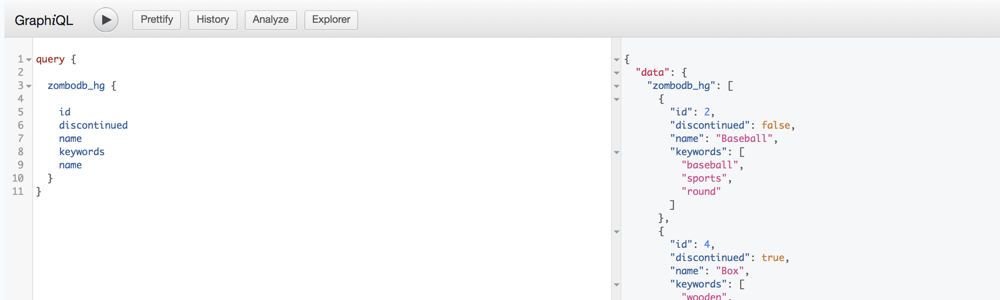

# zombodb with hasura-graphql-engine demo

## how to running

* build image

> base image with centos/postgresql-10-centos7

```code
docker-compose build
```

* start server

> es && pg+zombodb && hasura-graphql-engine

```code
docker-compose up -d
```

* create extention

```code
CREATE EXTENSION zombodb;
```

* create test table

```code
CREATE TABLE products (
    id SERIAL8 NOT NULL PRIMARY KEY,
    name text NOT NULL,
    keywords varchar(64)[],
    short_summary text,
    long_description zdb.fulltext, 
    price bigint,
    inventory_count integer,
    discontinued boolean default false,
    availability_date date
);
```

* create index

```code

CREATE INDEX idxproducts ON products
                  USING zombodb ((products.*))
                   WITH (url='http://elasticsearch:9200/');
```

* import some data

```code
COPY products FROM PROGRAM 'curl https://raw.githubusercontent.com/zombodb/zombodb/master/TUTORIAL-data.dmp';
```

* do some search

```code
SELECT * FROM products WHERE products ==> 'sports box';

```

result

```code
2 Baseball  {baseball,sports,round} It's a baseball Throw it at a person with a big wooden stick and hope they don't hit it 1249  2 FALSE 2015-08-21
4 Box {wooden,box,"negative space",square}  Just an empty box made of wood  A wooden container that will eventually rot away.  Put stuff it in (but not a cat). 17000 0 TRUE  2015-07-01
```

* work with hasura-graphql-engine

> use view for integration

```code
create view zombodb_hg as

SELECT * FROM products WHERE products ==> 'sports box';
```

* some query

